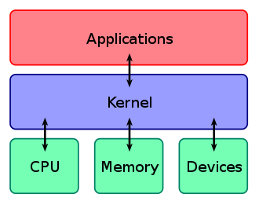

# Minix

[](https://github.com/HSNHK/Minix)
[](https://github.com/HSNHK/Minix)
[](https://github.com/HSNHK/Minix) [](https://github.com/HSNHK/Minix/releases/)
[](#license)
[](https://github.com/HSNHK/Minix/issues)

An example of a small Kernel

kernel type: monolithic

> A monolithic kernel is an operating system architecture where the entire operating system is working in kernel space. The monolithic model differs from other operating system architectures (such as the microkernel architecture) in that it alone defines a high-level virtual interface over computer hardware.

<p align="center">

</p>

## Build
```
build.sh 
```

```
qemu-system-x86_64 -cdrom iso/build/Minix.iso
```
## Tree
- drivers
    - keyboard
    - vga
        - console
- kernel
    - io

## License

Released under [MIT](/LICENSE) by [@HSNHK](https://github.com/HSNHK).
